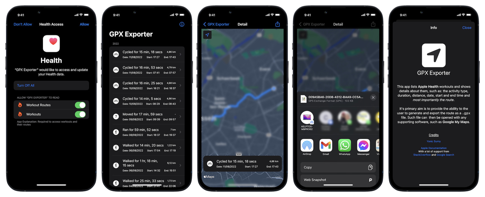

# GPX Exporter

This iOS app lists **Apple Health** workouts and shows details about them, such as: the activity type, duration, distance, date, start and end time and _most importantly the route_.

It's primary aim is to provide the ability to the user to generate and export the route as a `.gpx` file. Such file can then be opened with any supporting software, such as **Google My Maps**.

## Compatibility

* Built with Xcode 14.0.1 (14A400)
* Supported devices: iPhone (portrait)
* Deployment target: iOS 16.0
* Swift 5

## Screenshot

