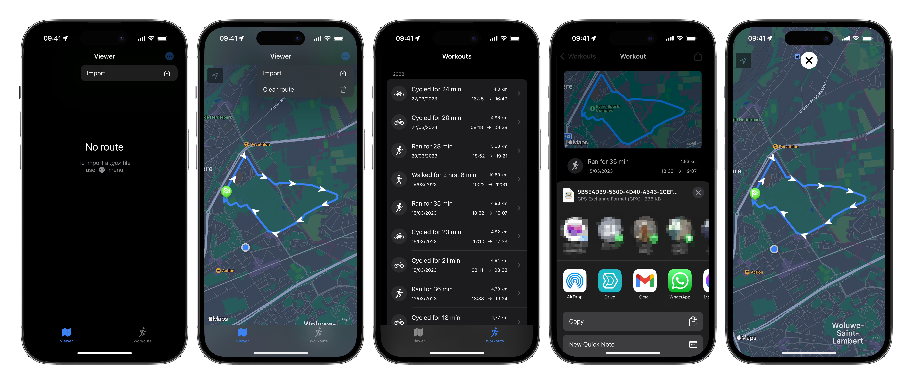

# GPX

This app provides 2 main functionality:

* Users can import a `.gpx` file to view the route on a map.
* Users can list **Apple Health** workouts (for walking, hiking, running and biking) and shows details about them, such as: the activity type, duration, distance, date, start and end time and _most importantly the route_. Users can generate and export the route of the workout as a `.gpx` file. Such file can then be opened with any supporting software, such as **Google My Maps**.

## Compatibility

* Built with Xcode 14.2 (14C18)
* Supported devices: iPhone (portrait)
* Deployment target: iOS 16.0
* Swift 5

## Dependencies (SPM)

* [vincentneo/CoreGPX](https://github.com/vincentneo/CoreGPX)

## Screenshots

